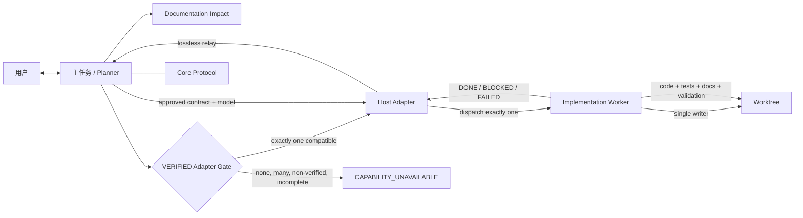

# 轻量级编码 Agent 编排框架设计规范

状态：APPROVED

版本：0.5

日期：2026-08-25

选定方案：Host-neutral Core + Verified-only Adapter Gate + Feature Documentation + Manifested Coding Rules + Deterministic Validation

## 1. 设计结论

协议 `0.5` 把此前分散的 Git、编码规范组件与 feature documentation 工作合并为一个一致、自包含的发布：

- Core 固定契约、两阶段、单写入者、工作树保护、文档维护、版本控制授权和 `DONE/BLOCKED/FAILED` 结果规则。
- Host Adapter Contract 固定九项能力；feature documentation evidence 由 `result_relay` 承载，不增加第十项能力。
- Planner 在批准实现或产品写入前，必须选择且只选择一个兼容的 `VERIFIED` Adapter。
- `EXPERIMENTAL`、`AUTHORING_ONLY` 和 `UNSUPPORTED` 均不可调度产品写入；用户同意不能改变 support state。
- Codex Adapter 以 protocol/adapter `0.5` 保持 `VERIFIED`，映射当前模型继承顺序、单 worker 生命周期、权限继承、结构化结果和独立 Git 授权。
- DSH Adapter 以 protocol/adapter `0.5` 保持 `EXPERIMENTAL`，仅作为可检查的候选映射；`dispatch_worker` 在产品写入前返回 `CAPABILITY_UNAVAILABLE`。
- Feature Documentation Convention、模板、契约字段、Core schema、Adapter relay、Git 边界、package index 与 canonical feature document 形成一条完整维护链。
- `assets/coding-rules/` 是本包内的组合适配资产，不依赖其他 spec 运行；`manifest.json` 对每个规则文件记录 SHA-256、来源和同步要求。
- 标准库 validator 与自动测试覆盖版本、链接、元数据、能力集、模板占位符、文档集成、manifest 和可选 source/install 一致性。

框架不引入服务、数据库、网络依赖、包管理依赖、第三阶段、并行 writer 或可执行编排 runtime。validator 只用于发布和安装校验。

## 2. 不变量

1. **两阶段**：对用户只有规划与实现。
2. **Planner 留在主任务**：当前主任务是唯一面向用户的 Planner。
3. **单一写入者**：一个 worktree 同时最多有一个 implementation worker。
4. **VERIFIED-only write gate**：只有兼容且再次验证通过的 `VERIFIED` Adapter 可调度产品写入。
5. **先批准后写入**：产品写入需要批准的契约和明确批准的实现模型。
6. **模型不静默替换**：具体模型、推理强度或父模型继承由 Adapter 按宿主真实顺序验证。
7. **契约不可暗改**：行为、范围、架构、依赖、路径、验收、文档、模型或 Adapter 变化需要新修订版。
8. **权限不可扩大**：Adapter 只能继承或收紧宿主权限。
9. **文档同原子边界**：必要 feature document 与 index 不是第三阶段，必须和实现、测试、必要 Changelog、配置同步。
10. **版本控制单独授权**：commit 与 push 分开批准且默认 `none`。
11. **结果必须有证据**：`DONE` 列出变更、验收、命令、`DOCUMENTATION`、版本控制、未验证项和风险。
12. **规范资产自包含**：实现时不得读取另一个 workflow spec；manifest drift 必须失败。

## 3. 架构与数据流

### 3.1 组件职责

| 组件 | 负责 | 不负责 |
| --- | --- | --- |
| Planner Skill | 规划、文档分类、Adapter Gate、批准、契约、调度、结果解释 | 产品文件写入 |
| Core Protocol | 宿主中立的不变量、契约、工作树、文档、版本控制与结果 schema | 宿主路径、Agent 名称、模型语法 |
| Host Adapter Contract | 元数据、九项能力、write gate、选择与失败规则 | 某宿主的具体工具映射 |
| Host Adapter | 把九项操作映射到一个宿主 | 改变 Core、拼接 Adapter、绕过 support state |
| Implementation Worker | 按批准契约写入与验证 | 用户决策、扩大范围、创建第二 writer |
| Implementation Contract | 冻结范围、模型、Adapter、Git、文档、编码规范与验收 | 可执行 runtime |
| Feature Documentation Convention | `create/update/not-required`、内容、导航、freshness 与验证 | 替代代码可读性或测试 |
| Coding-rule manifest | 固定本地规则资产文件集、hash、来源与同步义务 | 自动拉取上游或运行时发现 |
| Package validator | 离线、确定性地检查发布包与可选安装副本 | 编排任务或自动修复 drift |

### 3.2 Progressive disclosure

- [Planner Skill](skills/lightweight-coding-workflow/SKILL.md)：流程、审批、资源加载和 completion。
- [Core Protocol](skills/lightweight-coding-workflow/references/protocol.md)：契约、阶段、写入、结果 schema。
- [Host Adapter Contract](skills/lightweight-coding-workflow/references/adapter-contract.md)：接口、状态与 gate。
- [Feature Documentation Convention](skills/lightweight-coding-workflow/references/feature-documentation-convention.md)：canonical documentation policy。
- [Git convention](skills/lightweight-coding-workflow/references/git-commit-convention.md)：原子边界、Changelog 与 Conventional Commit。
- `references/adapters/*.md`：宿主具体映射。
- `assets/implementation-contract.md`：契约模板。
- `assets/feature-document.md`：feature document 模板。
- `assets/coding-rules/`：本地规范组件与 integrity manifest。
- `tools/validate_package.py` 与 `tests/test_validate_package.py`：发布校验。

Core 不包含 `.codex`、自定义 Agent 名称或宿主模型优先级；这些只存在于 Adapter。

## 4. Adapter Gate 与支持状态

Planner 在提案批准、批准契约创建和调度前执行只读检查：

1. 从宿主信号识别 host 与 surface。
2. 找到 `host_id` 与 surface 精确匹配的 Adapter。
3. 要求恰好一个匹配项为 `VERIFIED`。
4. 校验 protocol/adapter version、九项 capability、九项 operation 与当前宿主机制。
5. 在提案和契约中冻结 Adapter id/version。
6. 调度前重新检查 support state 与全部能力。

| 状态 | 含义 | 产品写入 |
| --- | --- | --- |
| `VERIFIED` | 九项操作在声明的 surface/version 上有保留证据 | 批准并复核后允许 |
| `EXPERIMENTAL` | 候选或可运行映射尚无完整证据 | 禁止 |
| `AUTHORING_ONLY` | 编写模板或设计材料 | 禁止 |
| `UNSUPPORTED` | 至少一项无合格映射 | 禁止 |

任何非 `VERIFIED` 匹配、缺项、歧义或版本不兼容都在产品写入前产生 `CAPABILITY_UNAVAILABLE`。不得让 Planner 代写，也不得用用户同意替代 retained evidence 与版本化 promotion。

## 5. 九项能力

| Capability | Operation | 核心保证 |
| --- | --- | --- |
| `host_identification` | `identify_host` | 只读识别宿主和 surface |
| `planner_binding` | `bind_planner` | 主任务保持 Planner 并解析资源 |
| `model_validation` | `validate_model` | 验证精确模型、effort 和可选继承 |
| `worker_dispatch` | `dispatch_worker` | 用完整 envelope 启动一个 worker |
| `permission_inheritance` | `inherit_permissions` | 权限只继承或收紧 |
| `lifecycle_control` | `control_lifecycle` | 管理所有权、继续、中断、停止与替换 |
| `progress_reporting` | `report_progress` | 无第二 writer 地观察进度 |
| `result_relay` | `relay_result` | 无损回传 status、证据与 `DOCUMENTATION` |
| `version_control_management` | `manage_version_control` | 默认只读，按独立精确授权处理 commit/push |

## 6. Codex Adapter 与模型行为

Codex Adapter 为唯一 `VERIFIED` 实例：

- 当前 Codex 主任务保持 Planner。
- 自定义 Agent `lightweight_implementer` 不固定 `model`、`model_reasoning_effort` 或 `sandbox_mode`。
- 当前宿主解析未在 Agent 文件中固定的模型字段时，顺序为 explicit spawn、`[agents]` default、parent；因此 `inherit-parent (user-approved)` 必须确认 default 不会截获继承。
- 精确模型使用精确 spawn override；无法表示时返回规划，不做 fallback。
- worker 继承主任务 live sandbox 与 approval policy。
- 调度信封包含契约、Core、task/revision、模型选择和 coding-rule 绝对路径。
- lifecycle 保证一个 writer；结果 relay 校验三种 schema 与 `DOCUMENTATION`。
- Git 默认只读；只有契约明确授权时才精确暂存/commit，push 需要另一个 remote/refspec 授权。

## 7. DSH Adapter

DSH Adapter 保留九项候选映射和 promotion checklist，但 support state 为 `EXPERIMENTAL`：

- 可进行文档、元数据、静态结构和隔离 fixture 验证。
- 不可被实现提案或批准契约选为 write adapter。
- `dispatch_worker` 在产品 writer 启动前返回 `CAPABILITY_UNAVAILABLE`。
- 只有完成全部 checklist、保留 evidence、独立 review 并发布新的 `VERIFIED` metadata 后，未来版本才可写。

## 8. Feature documentation

Planner 在提案中按 canonical convention 选择：

| Decision | 条件 | 结果 |
| --- | --- | --- |
| `create` | cohesive feature/module 尚无 canonical document | 创建 document 并加入 index |
| `update` | 行为、架构、接口、不变量、failure mode、导航或验证发生变化 | 更新 document，必要时更新 index |
| `not-required` | 稳定理解未改变的 trivial 或 behavior-preserving 修改 | 记录具体稳定理由 |

契约冻结 canonical path、feature index、code/test entry points、required sections 与 validation obligations。worker 在同一逻辑边界维护并验证它们。`DONE/BLOCKED/FAILED` 均报告 decision、路径、导航、验证和 freshness。

Package 自身的 [feature index](docs/features/README.md) 指向 [canonical feature document](docs/features/feature-documentation.md)，保留了用户已有文档工作的粒度与意图，并补充 validator/test entry points。

## 9. Bundled coding rules

`assets/coding-rules/` 保留 code contract、Python 和 C++/CMake 规范的组合适配副本。实现契约用绝对路径列出需要加载的文档；worker 在首次编辑前读取。运行时不导入或引用另一个 spec。

[manifest.json](skills/lightweight-coding-workflow/assets/coding-rules/manifest.json) 的规则：

- `manifest.json` 自身因自引用 hash 不可收敛而明确排除。
- 其他每个 bundled file 必须恰好出现一次，path 使用排序后的 normalized POSIX relative path。
- 每项记录 lowercase SHA-256、provenance 与 synchronization note。
- 缺失、额外、重复、路径异常或 hash 变化都使 validator 失败，直到同一变更更新 manifest。

## 10. Deterministic validation

[validator](tools/validate_package.py) 只使用 Python 标准库，排序并去重 findings，离线检查：

- `0.5` current-version declaration 与 historical release 分界；
- package-relative Markdown file/anchor links；
- Skill/Adapter YAML front matter、Agent TOML、UI YAML；
- Adapter identity、support state、exact nine capabilities 与 operation sections；
- VERIFIED-only write gate 与 stale eligibility language；
- template 之外的双花括号 placeholder；
- feature documentation contract/Core/Adapter/Git/index/document 集成；
- Core host neutrality、required sections 与 trailing whitespace；
- coding-rule manifest metadata、file set 与 hashes；
- 可选 installed Skill/Agent file set 与内容 parity。

[tests](tests/test_validate_package.py) 在临时 fixture 中分别注入 version drift、broken link、adapter drift、placeholder、documentation gap、manifest changed/missing/extra、invalid TOML/YAML 和 source/install drift，确认 validator 非零发现对应类别。

## 11. 安装边界

本机当前部署使用 `%USERPROFILE%\.codex\skills\lightweight-coding-workflow\` 与 `%USERPROFILE%\.codex\agents\lightweight_implementer.toml`。当前 Codex 文档同时给出 repository/user `.agents/skills` 等 portable Skill authoring/discovery 位置，以及 personal/project `.codex/agents` custom-Agent 位置。

这些位置是显式选择，不代表自动迁移或同步。source validator 通过可选 `--installed-skill` 和 `--installed-agent` 对实际目标做精确 parity 检查；implementation worker 只验证 source，用户级安装由 Planner 在具备权限后另行执行。

## 12. 兼容与升级

- v0.3 的历史职责是 Git 计划与证据。
- v0.4 的历史职责是引入 coding-rule candidate layer；其非 `VERIFIED` 写入路径不延续到 `0.5`。
- v0.5 同时发布 coding rules、feature documentation、VERIFIED-only gate、Codex `0.5` Adapter、manifest 与 validator。
- 旧批准契约保持不可变，只能配合匹配的历史资源继续，或通过规划产生新的 `0.5` revision。
- 不通过隐式 compatibility range 将 `0.5` Core 与旧 Adapter metadata 混用。

## 13. 验收场景

1. README、DESIGN、Skill、Core、Adapter Contract、Adapter metadata、contract asset、feature docs 与 Changelog 的 current release 都是 `0.5`。
2. Codex 为唯一 `VERIFIED` Adapter，front matter 含九项 capability 与九个 operation section。
3. DSH 保持 `EXPERIMENTAL`，任何产品 dispatch 在写入前失败。
4. Feature Documentation Convention、模板、index 与 canonical document 可导航，并贯穿 proposal、contract、implementation、result、Git boundary 与 completion。
5. Manifest 恰好覆盖全部 bundled rule files，任意 missing/extra/changed fixture 都失败。
6. 标准库 unit tests 与 source validator 退出 `0`。
7. Version/link/adapter/document/manifest/install drift fixtures 被确定性发现。
8. README 准确区分当前 `.codex` 部署与 portable discovery，并提供可执行 source/install 校验命令。
9. Agent TOML 与 UI metadata 不被版本化修改，Agent 仍保持 model-neutral。
10. 未经授权不修改 Git index、`HEAD` 或 remote；无关 spec 不发生变化。

## 14. 非目标和失败策略

协议 `0.5` 不增加 runtime、网络、第三方依赖、第三阶段、并行 writer、自动模型替换、自动 Skill 迁移、自动安装、自动 commit 或自动 push。

Adapter Gate 失败发生在批准和产品写入前，结果为 `CAPABILITY_UNAVAILABLE`。实现启动后，需要用户决策、权限、Documentation authority 或契约修订时为 `BLOCKED`；同一契约和环境下的证据表明无法继续时为 `FAILED`。
