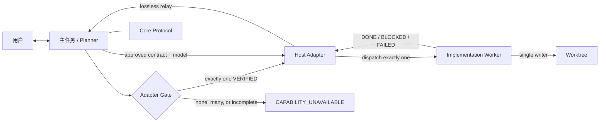
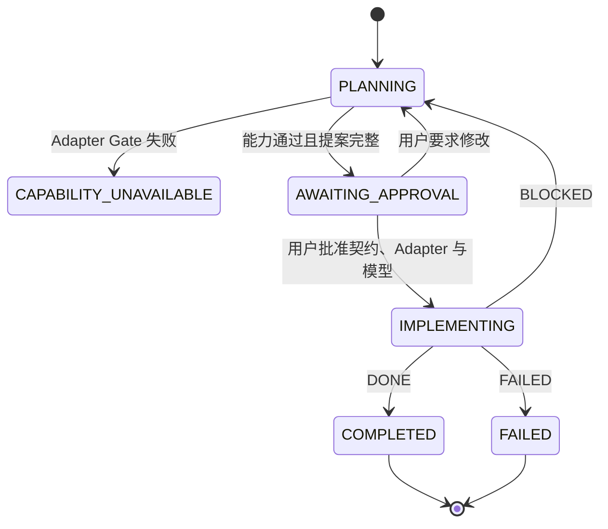

# 轻量级编码 Agent 编排框架设计规范

状态：APPROVED

版本：0.3

日期：2026-08-21

选定方案：Host-neutral Core + Host Adapter Contract + Verified Codex Adapter

## 1. 设计结论

v0.3 在 v0.2 的宿主中立 Core 与 Host Adapter 架构上加入 Git 版本管理契约：

- Core 固定契约、阶段、单写入者、工作树保护、版本控制授权和 `DONE/BLOCKED/FAILED` 结果规则。
- Host Adapter Contract 固定宿主识别、Planner 绑定、模型验证、worker 调度、权限继承、生命周期、进度、结果回传和版本控制管理接口。
- Planner 在批准实现或发生产品代码写入前，必须选择且只选择一个兼容的 `VERIFIED` Adapter，并验证全部必需能力。
- Codex Adapter 是 v0.3 唯一 `VERIFIED` Adapter，保持 v0.2 的 Codex 行为与安装布局，并映射只读 Git baseline、精确暂存、授权提交和独立授权推送。
- 通用 Adapter Template 为 `AUTHORING_ONLY`，只用于编写未来映射，不代表任何宿主可执行。
- 完整 Git 提交与 Changelog 规范只保留在 Skill canonical reference；仓库级文档只提供发现链接。

框架仍然不引入服务、CLI、数据库、依赖、第三阶段或并行写入者，也不把实现批准解释为暂存、提交或推送授权。

## 2. 不变量

1. **两阶段**：用户只看到规划和实现两个阶段。
2. **Planner 留在主任务**：当前主任务是唯一面向用户的 Planner，且其模型不被框架覆盖。
3. **单一写入者**：一个工作树在任一时刻最多有一个 implementation worker。
4. **先批准后写入**：产品代码写入需要批准的契约和用户明确批准的实现模型。
5. **模型不静默替换**：具体模型、推理强度或明确的父模型继承由 Adapter 验证和映射。
6. **契约不可暗改**：行为、范围、架构、依赖、路径、验收、模型或 Adapter 变化都需要新修订版。
7. **阻塞优于猜测**：需要用户决策、新权限或扩展范围时返回 `BLOCKED`。
8. **结果必须有证据**：`DONE` 必须列出路径、验收证据、命令退出状态、未验证项和风险。
9. **权限不可扩大**：Adapter 只能继承或缩小宿主任务权限。
10. **只有 VERIFIED 可写**：其他支持状态不能调度产品代码实现。
11. **版本控制单独授权**：commit 和 push 分别授权且默认 `none`；commit authority 永不隐含 push authority。

## 3. 架构



### 3.1 组件职责

| 组件 | 负责 | 不负责 |
| --- | --- | --- |
| Planner Skill | 规划、Adapter Gate、批准、契约、调度、结果解释 | 产品代码写入 |
| Core Protocol | 宿主中立的不变量、契约、工作树、版本控制授权和结果 schema | 宿主路径、Agent 名称、模型调度语法 |
| Host Adapter Contract | Adapter 元数据、九项能力、操作、选择和失败规则 | 某个宿主的具体实现 |
| Host Adapter | 把全部必需操作映射到一个宿主 | 改变 Core 或拼接多个不完整 Adapter |
| Implementation Worker | 按批准契约编码与验证 | 用户决策、扩大范围或创建另一个写入者 |
| Implementation Contract | 冻结任务范围、模型、Adapter 和验收条件 | 可执行运行时 |

### 3.2 Progressive disclosure

- `SKILL.md`：只保留编排流程、Core 不变量与 Adapter Gate。
- `references/protocol.md`：契约、阶段、工作树、单写入者和结果 schema。
- `references/adapter-contract.md`：Adapter 接口、支持状态、选择和失败规则。
- `references/git-commit-convention.md`：Git 提交边界、精确暂存、Changelog 和 Conventional Commit 的 canonical policy。
- `references/adapters/*.md`：每个宿主的具体映射。
- `assets/implementation-contract.md`：契约数据模板。

Core 不包含 Codex 路径、自定义 Agent 名称或 Codex 模型优先级；这些内容只存在于 Codex Adapter。

## 4. Host Adapter Contract

### 4.1 必需元数据

每个 Adapter 声明 `host_adapter`、`host_id`、`display_name`、`protocol_version`、`adapter_version`、`support_state`、`supported_surfaces`、`capabilities` 和 `verified_on`。

### 4.2 必需能力和操作

| 能力 | 操作 | 保证 |
| --- | --- | --- |
| `host_identification` | `identify_host` | 只读识别宿主和 surface |
| `planner_binding` | `bind_planner` | 当前用户任务保持 Planner，并解析协议、资产、仓库和任务记录 |
| `model_validation` | `validate_model` | 验证用户批准的模型、推理强度和可选父模型继承 |
| `worker_dispatch` | `dispatch_worker` | 用完整 envelope 启动且只启动一个 worker |
| `permission_inheritance` | `inherit_permissions` | 权限只继承或收紧 |
| `lifecycle_control` | `control_lifecycle` | 安全处理所有权、启动、继续、中断、停止和替换 |
| `progress_reporting` | `report_progress` | 观察进度且不创建第二写入者 |
| `result_relay` | `relay_result` | 无损回传一个 Core 结果 schema |
| `version_control_management` | `manage_version_control` | 默认只读检查版本状态，只在契约精确授权时暂存、提交，并在单独授权时推送 |

每个映射都要说明前置条件、具体宿主机制、输入输出、失败信号、Core 失败分类和验证依据。

## 5. Adapter Gate

Planner 在请求实现批准、写入批准契约或允许产品代码写入之前执行：

1. 使用只读宿主信号识别当前 host 和 surface。
2. 找到 `host_id` 与 surface 精确匹配的 Adapter。
3. 要求恰好一个 Adapter 为 `VERIFIED`。
4. 验证 `protocol_version` 兼容、`adapter_version` 非空、九项能力完整。
5. 验证每个操作依赖的宿主机制当前可用。
6. 在提案和契约中记录 Adapter id 与版本。
7. 调度前再次验证。

零个、多个、不兼容或能力缺失都返回 `CAPABILITY_UNAVAILABLE`。Planner 不自行编码，不借用其他宿主 Adapter，也不合并两个部分映射。

## 6. 支持状态

| 状态 | 含义 | 默认允许实现写入 |
| --- | --- | --- |
| `VERIFIED` | 所有必需操作已在所声明 surface 上映射并验证 | 是，通过批准和再次验证后 |
| `EXPERIMENTAL` | 可运行映射存在，但验证不完整 | 否 |
| `AUTHORING_ONLY` | 只有编写模板或设计材料，无可执行支持声明 | 否 |
| `UNSUPPORTED` | 至少一个必需操作没有合格映射 | 否 |

## 7. Support Matrix（支持矩阵）

| Host / artifact | 状态 | Protocol | Adapter | 产品代码写入 |
| --- | --- | --- | --- | --- |
| Codex Desktop / CLI / IDE extension | `VERIFIED` | `0.3` | `codex` `0.3` | 是 |
| Generic adapter template | `AUTHORING_ONLY` | `0.3` | 未实例化 | 否 |
| Claude Code | `UNSUPPORTED` | 无 | 无 | 否 |
| Cursor | `UNSUPPORTED` | 无 | 无 | 否 |
| OpenCode | `UNSUPPORTED` | 无 | 无 | 否 |
| Gemini CLI | `UNSUPPORTED` | 无 | 无 | 否 |
| 其他未命名宿主 | `UNSUPPORTED` | 无 | 无 | 否 |

本矩阵不把概念相似性视为支持证据。v0.3 没有 `EXPERIMENTAL` 宿主 Adapter。

## 8. 两阶段状态模型



`DISPATCHING`、`RUNNING` 或 `VERIFYING` 等宿主内部状态不构成第三阶段。

## 9. Implementation Contract v0.3

v0.3 保留 v0.2 的全部字段和章节，并新增完整的 Version control 章节：

| 字段 | 含义 |
| --- | --- |
| Version-control system | `git` 或 `none`；后者跳过 Git 操作 |
| Baseline | Git root、branch/detached、revision、index/staged state 和需保留修改 |
| Logical commit boundary | 一个逻辑变更与精确路径 |
| Changelog disposition | required/not-required、文件、分类和用户视角条目或理由 |
| Proposed message | 符合 Conventional Commits 的拟议消息 |
| Commit authority | 默认 `none`，只接受用户对该逻辑边界的精确授权 |
| Push authority | 默认 `none`，与 commit 分离，并在授权时记录 remote/refspec |

批准后，Version control 决策、模型、推理强度、Adapter 或版本改变都需要新契约修订版。Adapter 决定任务记录的宿主路径，Core 不固定路径。

## 10. Codex Adapter

Codex Adapter 将九项操作映射到既有行为：

- 当前 Codex 主任务和当前模型保持 Planner。
- 用户明确批准具体实现模型，或明确批准 `inherit-parent (user-approved)`。
- 具体模型使用精确 spawn override；明确父模型继承时有意省略 override。
- 自定义 Agent 为 `lightweight_implementer`，其 TOML 保持模型中立且不固定沙箱。
- worker 继承父任务权限和审批策略。
- Codex subagent 生命周期保证单写入者、继续、中断和安全替换。
- 原始工具日志留在实现任务，主任务只接收简洁进度和结构化最终结果。
- 契约仍保存在 `.codex/task-runs/<task-id>/`，用户级安装仍是 Skill 目录加 Agent TOML。
- Git baseline 使用只读命令记录；commit authority 为 `none` 时不修改 index 或 `HEAD`。
- 精确 commit authority 存在时只暂存契约路径、检查 staged diff、验证消息并记录 commit SHA；push 仅在独立 remote/refspec 授权后执行。

这些 Codex 专用细节不进入 Core。

## 11. 结果和工作树保护

Core 保留 `DONE`、`BLOCKED` 和 `FAILED` 三种状态，并扩展每个 Markdown schema，记录 version-control system、baseline、Changelog disposition、commit status 或 proposed message，以及 push status。`DONE` 只有在全部可行验证执行后成立；失败或跳过的检查必须明确列出。

调度前记录仓库根目录、分支或 detached 状态、revision、index/staged state、未提交路径和需要保留的修改。worker 在接触未获授权的重叠修改前返回 `BLOCKED`。任何 writer 替换都必须先确认前一 writer 已停止、完成或关闭。

## 12. 源包布局

```text
lightweight-coding-agent-workflow-spec/
├── CHANGELOG.md
├── DESIGN.md
├── README.md
├── agents/
│   └── lightweight_implementer.toml
└── skills/
    └── lightweight-coding-workflow/
        ├── SKILL.md
        ├── agents/
        │   └── openai.yaml
        ├── assets/
        │   └── implementation-contract.md
        └── references/
            ├── protocol.md
            ├── adapter-contract.md
            ├── git-commit-convention.md
            └── adapters/
                ├── codex.md
                └── template.md
```

## 13. Compatibility（兼容性和升级）

- v0.3 保留 v0.2 的两阶段、Planner/Implementer 职责、单写入者、显式模型选择与 Codex 权限行为。
- 用户级安装路径不变；`lightweight_implementer.toml` 和 `agents/openai.yaml` 不需要因 v0.3 改写。
- v0.3 新契约保留三项 Adapter 元数据并新增 Version control 决策；结果 schema 同步增加版本控制证据。
- 已批准的旧契约不会被原地修改。恢复旧任务时使用匹配的旧协议，或重新规划并明确批准一份 v0.3 修订版。
- Adapter `protocol_version` 必须与 Core 精确匹配，除非 Adapter 明确声明并验证兼容范围。

## 14. 非目标和失败策略

v0.3 不实现或声称支持非 Codex 宿主，不增加 runtime、依赖、第三阶段、并行 writer 或自动模型替换。它不自动暂存、提交、推送、部署或发布；只有契约中的精确独立授权才能启用对应版本控制操作。

Adapter Gate 失败发生在批准和产品写入前，结果为 `CAPABILITY_UNAVAILABLE`。实现启动后，需要用户决策、权限或契约修订时为 `BLOCKED`；同一契约和环境下的证据表明无法继续时为 `FAILED`。
