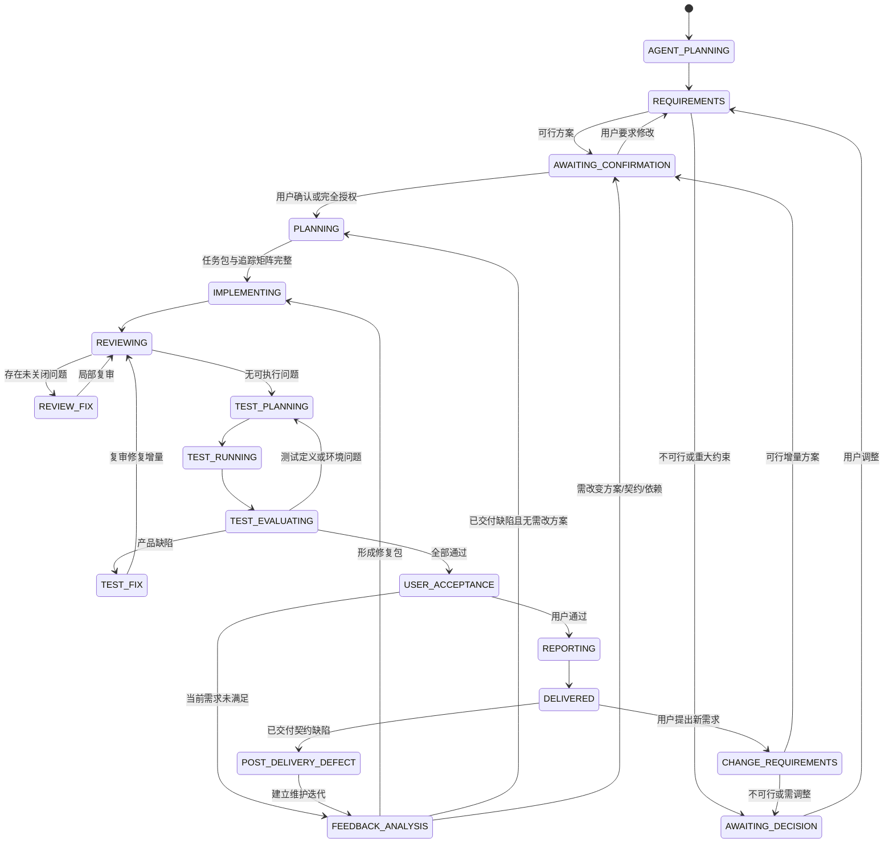

# 小项目交付工作流规范

状态：已确认  
规范版本：`SPW-1.1`  
适用范围：以 Python 或 C++ 为主、规模较小、可在少量迭代内完成的项目及其后续增量需求。

“必须（MUST）”表示门禁硬要求，“应该（SHOULD）”表示默认做法，“可以（MAY）”表示按场景选择。正文中的“必须、不得、只有”均按 MUST 解释。

### 适用边界

小项目默认满足：单仓库或单一工作区、一个主要交付物、一个主实现语言、一个实现 Agent 可串行完成，且不包含跨服务的不可逆迁移。代码量很小但涉及安全、医疗、金融、生产基础设施、不可逆数据迁移或其他高风险决策时，必须升级为专项流程，不能因“规模小”降低门禁。

## 1. 目的

本规范把用户需求稳定地转化为可交付项目，并通过明确的 Agent 分工、代码契约、Review、测试和用户验收形成可重复迭代的闭环。

每个项目必须先回答：

1. 项目要解决什么问题，最终目的是什么。
2. 为达到目的应走怎样的实现路径。
3. 哪些结果可以证明目的已经基本实现。

寻找路径时，可以先研究同类项目的产品形态、交互方式、技术结构或算法实现，再结合当前约束重新编排。必须记录借鉴的模式与来源；不得复制未授权代码或资产，时间敏感的结论必须重新核验。规划 Agent 给出方案后，必须获得用户确认；只有用户明确表示完全遵循 Agent 安排时，才可跳过方案确认。该授权不代替外部写入、破坏性操作、安全授权或最终用户验收。

## 2. 规范权威与规则优先级

冲突按以下顺序裁决：

1. 正确性、安全性、平台、法律和兼容性硬约束。
2. 用户对当前项目的明确要求。
3. 仓库内正式配置、公共 API/ABI、数据格式、CI 和测试契约。
4. 受影响模块内稳定且重复的第一方约定。
5. 本规范及语言 skill 的绿地默认值。

既有项目优先兼容现状；绿地项目使用本规范的最小默认结构。不得借局部功能修改进行无关重构、全仓格式化、工具链升级或目录重排。

## 3. Skill 套件

`SPEC.md` 是唯一流程规范源。总控和阶段 skill 采用兄弟目录；总控按状态通过当前 Harness 的原生 skill loader 显式加载它们。这里的“调用某 skill”始终表示先加载该 skill 的完整指令，再按其输入/输出契约执行，不能仅把名称当作提示文字。

源套件由根 `SPEC.md` 与 `skills/<skill-name>/...` 组成。Harness 构建器必须把 14 个 skill 完整复制到该 Harness 的项目级 skills 根，并把根 `SPEC.md` 的逐字节副本写入已安装总控的 `references/SPEC.md`。构建清单必须记录两者哈希且校验相同；安装产物不得依赖源目录或环境中的同名 Python/C++ 规范。

| Skill | 角色 | 唯一职责 |
|---|---|---|
| `small-project-workflow` | 总控 | 维护状态、检查门禁、选择下一阶段 |
| `small-project-agent-plan` | 强模型 | 在项目开始时建立模型、角色和委派策略 |
| `small-project-requirements` | 强模型 | 初始或新增需求的规范化、可行性、路径、技术选型和确认 |
| `small-project-planning` | 强模型 | 把确认方案转成模块、文件、追踪矩阵和任务包 |
| `small-project-implement` | 执行模型 | 执行已确认实现包、Review 修复包或测试修复包 |
| `small-project-review` | 独立强模型 | Review 本迭代变更并生成可执行问题包 |
| `small-project-test-plan` | 强模型 | 制定测试计划、通过条件并判定执行结果 |
| `small-project-test-run` | 执行模型 | 严格执行测试计划并保存原始证据 |
| `small-project-acceptance` | 强模型总控 | 展示结果并分类用户反馈 |
| `small-project-feedback-analysis` | 强模型 | 对当前范围缺陷进行溯源并生成修复包 |
| `small-project-report` | 执行模型 | 根据已验证事实形成总结报告 |
| `small-project-code-contract` | 规范 | 跨语言模块、函数、边界验证和依赖契约 |
| `small-project-python-rules` | 内置规范 | Python 工程、可视化和向 C++ 迁移规则；不依赖环境外部 Python skill |
| `small-project-cpp-rules` | 内置规范 | C++/CMake 完整规范、参考资料和检查脚本；不依赖环境外部 C++ skill |

只有总控 skill 拥有宽泛的自然语言触发和状态迁移权。阶段与语言 skill 设为显式调用，避免与现有 `spec`、`review`、`investigate` 或其他通用 skill 抢触发。

## 4. Agent 编排

### 4.1 能力角色与 Harness 映射

| 工作 | 稳定能力角色 | 权限与隔离 |
|---|---|---|
| Agent 编排、需求、路径、架构和技术选型 | `decision_strong` | 决策；不得由执行角色代替 |
| 编码、修复 | `execution_bounded` | 仅在任务包授权范围内写入 |
| Code Review 与局部复审 | `review_strong_isolated` | 独立上下文、只读判定，不得由实现者自审 |
| 测试规划、失败分类和结果判定 | `decision_strong` | 只读决策，与测试执行分离 |
| 测试执行与重测 | `execution_bounded` | 按不可变计划执行，不改变通过条件 |
| 最终报告 | `report_bounded` | 只根据已验证证据汇总 |

具体模型 ID 和推理档位是 Harness 构建时配置，不属于业务规范。构建前必须通过目标 Harness 的模型目录核验配置值，再由构建器记录：强角色映射到当前最强可用模型，执行与报告角色映射到受约束的低一级模型；所有角色都使用该模型支持的最高已确认推理档位。构建器只校验格式和完整性，不得把“用户提供了值”冒充为实时可用性证明。强角色不可静默降级；执行角色回退必须记录。任何 Harness 若不能提供独立上下文、角色级模型选择或 Review 只读约束，必须返回 `CAPABILITY_UNSATISFIED` 并停止相关门禁，不能在同一上下文中假装完成独立 Review。

当前推荐映射仅作为 adapter 默认候选：Codex 为强角色 `gpt-5.6-sol/ultra`、执行和报告 `gpt-5.6-luna/max`，Luna 不可用时显式回退 `gpt-5.6-terra/max`；OpenCode 使用安装时验证过的 `provider/model` 与 model variant；Pi 使用安装时验证过的 `provider/model`，并把其不支持的 `ultra` 映射为最高 `max`。adapter 必须记录最终解析值，不能把候选值当成已验证可用性。

### 4.2 小项目并发策略

小项目默认顺序执行。不得让多个写 Agent 同时修改同一工作树。只有互不依赖的只读研究、测试或审计任务适合并发；最终判定仍由强模型完成。

### 4.3 统一任务包

每次委派至少包含：

```yaml
task_id: I01-TASK-001
iteration_id: I01
phase: IMPLEMENTING
mode: initial # initial | review-fix | test-fix
baseline: <commit-or-artifact-id>
confirmed_spec_version: SPEC-01
objective: <single bounded outcome>
in_scope: []
out_of_scope: []
allowed_mutations: []
inputs: []
applicable_rules: []
acceptance_criteria: []
required_evidence: []
return_contract: []
stop_conditions: []
```

缺少确认版 spec、允许范围或验收条件时，执行 Agent 不得编码。执行 Agent 不得自行改变需求、架构、公共接口、依赖选型或测试通过条件；发现冲突应返回强模型。

## 5. 生命周期与门禁



阶段 ID：`INIT-01 -> REQ-01 -> FEAS-01 -> SOL-01 -> CONF-01 -> PLAN-01 -> IMPL-01 -> REV-01/FIX-01 -> TPLAN-01/TEST-01 -> UAT-01 -> RPT-01 -> DLV-01`。交付后的新需求从 `CHG-01` 创建下一迭代并回到 `REQ-01`。

阶段门禁：

| Gate | 通过条件 |
|---|---|
| `G0 INTAKE_READY` | 目的、对象、当前/目标行为、输入输出、约束、非目标和可观察完成标准已明确；未知项已标记 |
| `G1 SOLUTION_APPROVED` | 可行性、路径、技术/依赖、影响、风险、回滚和 AC 已由用户确认，或已有明确代决授权 |
| `G2 IMPLEMENTATION_READY` | 基线、模块、文件范围、任务包、语言规则、Agent 路由、测试意图和追踪关系完整 |
| `G3 IMPLEMENTATION_COMPLETE` | 实现 Agent 返回完整变更和原始检查证据，没有未说明的越界修改 |
| `G4 REVIEW_CLEAR` | 未关闭的 actionable finding 数为 0 |
| `G5 TEST_READY` | 每个 AC 已关联测试/人工证据，环境、数据、预期、容差与证据格式完整 |
| `G6 TEST_PASS` | 强模型根据原始证据判定所有计划测试通过 |
| `G7 UAT_ACCEPTED` | 用户明确接受当前交付；沉默不能视为通过 |
| `G8 DELIVERED` | 报告、版本、基线、剩余风险和验收记录已封存 |

需求或验收条件变化会使后续实现、Review 和测试结论失效；代码变化会使相关 Review 和测试结论失效；已交付迭代保持只读。

## 6. 需求与技术方案

每个初始需求或新需求输出以下内容：

1. `PURPOSE`：项目目的、使用者和成功结果。
2. `CURRENT`：既有项目的已验证现状；绿地项目标记为空。
3. `PATH`：达到目的的步骤、依赖顺序和同类项目启发。
4. `FEASIBILITY`：可行、附条件可行或不可行，并列出限制。
5. `TECH`：语言、框架、第三方库、运行平台和迁移考虑。
6. `SCOPE`：范围内、范围外和不可触碰内容。
7. `AC`：具体、可判定的验收条件。
8. `TEST-BASIS`：是否提供测试数据、期望结果和容差。
9. `DECISION`：等待确认、已确认或不可行。

若用户没有定义会改变方案的关键行为，必须在确认前收敛。例如 CSV 工具需明确列选择、X 轴/系列映射、编码与分隔符、空行/缺失值口径，以及 PNG 尺寸/分辨率；这些属于需求边界，不得留给实现 Agent 猜测。

稳定 ID 使用 `PRJ-OBJ-001`、`PRJ-CON-001`、`PRJ-NFR-001`；迭代项使用 `I01-REQ-001`、`I01-AC-001`、`I01-OOS-001`、`I01-DEC-001`、`I01-RISK-001`、`I01-TASK-001`、`I01-REV-001`、`I01-DEF-001`、`I01-TST-001`、`I01-EVD-001`、`I01-UAT-001` 和 `I01-CHG-001`。ID 发布后不得重排、删除或复用；废弃项标记 `superseded` 或 `rejected` 并指向替代项。

### 6.1 技术选型

- 需要可视化、数据探索、快速交互或原型验证时，默认优先 Python。
- 性能、部署、硬件 SDK、实时性、内存或已有生态要求 C++ 时，选择 C++。
- 允许先用 Python 验证算法与交互，再将确认的计算核心迁移到 C++。
- 第三方库只能在技术方案阶段提出，必须说明用途、标准库替代方案、维护收益以及许可、体积、平台和部署代价。未经确认，执行 Agent 不得新增依赖。

## 7. 跨语言代码契约

### 7.1 项目与模块

- 按真实职责或能力纵向划分模块；不同模块使用文件夹隔离。
- 小项目不得为了套模板创建空层级。一次性单文件工具可以保持单文件；出现第二个稳定职责时再拆分。
- 分离外部输入、领域/计算逻辑、I/O、可视化和程序入口。
- 公共契约与私有实现分开，依赖由易变外层指向稳定内层。

### 7.2 函数设计

仅在至少一项成立时拆分函数：

1. 能在多个位置复用。
2. 是可被替换的独立功能。
3. 隔离外部副作用、资源或适配器边界。
4. 形成可独立理解和测试的稳定步骤。

不得按行数机械拆分；不得为单一调用路径预建接口；不得创建只转发一次且不形成稳定边界的包装函数。

### 7.3 输入验证

- 每次数据跨越新的外部信任边界时，完成一次解析、类型/范围检查、规范化和领域值转换。
- 信任边界包括 CLI、UI、API、配置/文件解析、网络、数据库结果、FFI、插件输出以及可复用库的 public API。
- 边界之后的内部函数以明确前置条件工作，不重复执行同一组类型、范围、空值或格式验证。
- 程序员不变量 assertion、内存安全、并发、生命周期、ABI 和只能由运行状态判断的检查不属于冗余输入验证，必须保留。

## 8. Python 代码规范

### 8.1 适配与结构

既有项目先读取 `pyproject.toml`、锁文件、Ruff/Black、mypy/pyright、pytest、CI 和相邻第一方代码。绿地小项目默认：

```text
project/
├── pyproject.toml
├── src/<package>/
│   ├── __init__.py
│   ├── core/ 或 domain/       # 按需
│   ├── services/              # 按需
│   ├── adapters/              # 文件、网络、UI 等边界
│   ├── visualization/         # 可视化项目按需
│   └── __main__.py            # CLI 按需
└── tests/
```

仅创建真实需要的目录。一次性脚本可以采用 `script.py + tests/` 或最小 smoke 命令。

### 8.2 编码规则

- 遵循 PEP 8：模块、函数和变量使用 `snake_case`；类型使用 `PascalCase`；常量使用 `UPPER_SNAKE_CASE`；4 空格缩进。
- 导入按标准库、第三方和本项目分组；优先绝对导入；禁止 wildcard import 与 `sys.path` hack。
- 公开函数和非平凡内部函数提供类型标注。类型标注是静态契约，不得用运行时类型检查装饰器在内部重复验证。
- 数据值优先使用 `dataclass` 或轻量不可变对象；单一路径直接实现。
- 可替换行为使用窄 `Protocol`、ABC 或 callable，不创建宽泛框架。
- I/O、UI、文件和网络放在适配层；计算核心尽量使用纯函数。
- 资源使用 context manager，文件系统路径使用 `pathlib`；同一层使用一致的异常模型，仅在边界补充上下文和转换异常。
- 禁止可变默认参数、裸 `except`、静默吞错、无必要全局可变状态和导入期副作用。
- 默认工具为 Ruff 和 pytest；只有类型风险明显时增加 mypy 或 pyright。

### 8.3 可视化与依赖建议

按需求选择，标准库足够时不引入第三方库：

| 需求 | 候选库 |
|---|---|
| 数组/数值计算 | NumPy |
| 表格数据 | pandas 或 Polars，二选一 |
| 静态图表 | Matplotlib；现有生态或统计图需求明确时可搭配 Seaborn |
| 交互图表 | Plotly |
| 科学计算 | SciPy |
| 图像处理 | Pillow；复杂视觉算法才用 OpenCV |
| 桌面 UI | PySide6 |
| 复杂外部 schema | Pydantic，仅用于边界 |
| 测试 | pytest |

数据准备与渲染必须分离。渲染函数返回 figure/axes、组件对象或明确输出路径，避免把业务计算锁在 UI 中。

### 8.4 Python 向 C++ 迁移

迁移是契约迁移，不是逐行翻译：

1. 冻结输入输出 schema、dtype、shape、单位、内存布局、错误语义、随机种子和数值容差。
2. 用 profile 证明性能、部署、硬件、内存或实时性需求。
3. 仅迁移受约束的计算核心；可视化通常保留在 Python。
4. 建立 golden data 与 Python/C++ 差分测试。
5. 建立 C++ target 和稳定 API，再按环境选择 pybind11、nanobind 或 CLI 集成。
6. 等价性和性能验证通过后切换权威实现，避免两套业务逻辑长期漂移。

## 9. C++/CMake 代码规范

### 9.1 最小结构

```text
project/
├── CMakeLists.txt
├── CMakePresets.json       # 需要可重复配置时
├── cmake/                  # 可复用模块，按需
├── include/<project>/      # 仅稳定公共库接口需要
├── src/                    # 私有实现
├── apps/ 或 tools/         # 可执行入口
├── tests/
├── examples/               # 按需
└── docs/                   # 按需
```

- 只有组件可独立构建、测试或复用时才拆成独立 CMake target。
- 使用 target-based CMake；依赖采用最窄正确的 `PUBLIC`、`PRIVATE` 或 `INTERFACE` 作用域。
- 每个依赖只有一个权威来源，生成文件进入 binary tree，不硬编码本机绝对路径。
- 多配置生成器不得依赖 `CMAKE_BUILD_TYPE`。

### 9.2 类型、接口与所有权

- 公共 API 使用稳定领域类型，不泄漏具体后端、私有实现或外部库类型。
- 默认值语义、RAII 和明确的唯一所有权；`shared_ptr` 必须有真实共享生命周期需求；裸指针/引用表示借用。
- 单一路径使用函数或具体类型；运行时替换使用小接口或 callable；编译期策略使用 concepts、traits 或 policy。
- 多态接口使用虚析构，具体实现标记 `final`，重写标记 `override`。
- 使用 `enum class`、`nullptr` 和 named cast；禁止 `using namespace std;` 和父目录相对 include。
- 同一层使用一种错误模型；异常不得穿越不支持异常的 ABI 边界。
- 便利重载必须转发到 canonical implementation，不复制转换或输入验证。

### 9.3 绿地命名和格式默认值

仓库没有规则时：文件、函数和变量使用 `snake_case`；类型和 concept 使用 `PascalCase`；宏使用 `UPPER_SNAKE_CASE`；4 空格、无 Tab；默认 `.h/.cpp`。格式化器和现有模块约定优先。

完整实现和 Review 必须读取 workflow 内 `small-project-cpp-rules` 及其按任务指定的内置 `references/`；不得读取或依赖环境中的同名/相似 C++ 规范 skill。该内置规范随 workflow 一起版本化。

## 10. 编码与 Code Review

编码按确认方案、任务包、跨语言契约和对应语言 skill 进行。

首次 Review 检查本迭代全部变化以及直接受影响的契约，重点包括逻辑错误、行为回归、规范违反、未授权范围扩张和必要测试缺口。不得把纯个人偏好当作问题。

每个问题使用稳定 ID：

```yaml
finding_id: I01-REV-001
severity: blocker # blocker | major | normal | minor
location: path:line
observed_behavior: <what happens>
evidence: <reproduction or code path>
expected_behavior: <confirmed contract>
required_change: <bounded outcome, not implementation guess>
affected_scope: []
verification: []
status: open
```

问题由强模型打包给执行模型修复。局部复审只检查修复 diff、原问题、直接调用者/被调用者、相关接口和测试；允许读取其他代码理解上下文，但不得重审无关历史代码。通过条件为未关闭的可执行问题数为 0。

同一问题连续两轮没有有效进展时，不得盲目循环；强模型重新进行根因和方案分析。第三次仍是同一外部阻塞时再向用户请求决策；只要有新证据或进展，不设置机械循环上限。

## 11. 测试

强模型根据验收条件制定不可变测试计划，执行模型只运行并保存命令、退出码、日志、实际值、可视化文件和复现步骤。

测试基线：

1. 未提供测试数据：至少验证 import/configure、启动或构建，以及一条最小代表路径能运行且不报错；只能声称基本可运行。
2. 提供数据和具体期望：结果应基本符合用户要求，并采用已确认容差。
3. 提供数据但没有具体期望：强模型先定义结构、数量、范围、单位、缺失值、确定性和不变量等完整性 oracle；无法定义时必须披露“正确性未验证”并向用户确认，不得仅凭成功运行声称准确。

语言 skill 可以提供 pytest、CMake、sanitizer 等检查项，但总测试 skill 决定测试时机与门禁。

失败由强模型分类：

- 产品缺陷：生成 `test-fix` 任务包，执行修复，局部 Review，再运行失败测试、受影响测试和最小 smoke。
- 测试定义或环境问题：修正测试计划或环境后重测，不修改产品代码。
- 原因不明：先诊断，不得无变化地重复运行。

## 12. 用户验收、交付和新需求

向用户提供变更摘要、测试结果以及可视化产物。反馈只能先分类为：

- `accepted`：用户确认没问题，生成报告并交付。
- `current-scope-defect`：已确认行为未达到，保持当前迭代，先溯源再进入修复循环。
- `new-requirement`：增加或改变已确认范围；只有当前版本交付后才建立下一迭代。
- `needs-clarification`：无法区分或没有具体问题点，先询问用户，不猜测、不编码。

用户沉默时保持 `AWAITING_UAT`，不得推定验收通过。混合反馈必须拆分：违反当前 AC 的部分作为缺陷，要求新行为的部分作为变更。

反馈发生在交付前 UAT 时，当前范围缺陷保留在当前迭代并回到修复循环。反馈发生在 `DELIVERED` 后时，旧迭代和旧 ID 保持只读，任何工作都建立下一迭代：

- 仅恢复旧 AC：建立 `iteration_kind: maintenance`，在新迭代登记 `I02-DEF-001` 并反向引用 `I01-AC-xxx`。完成根因分析后，若修复不改变需求、公共契约、架构或依赖，可直接进入强模型规划和实现；否则必须重新提交方案确认。
- 仅增加行为：建立 `iteration_kind: change`，在新迭代登记 `I02-CHG-001`，完整执行需求、可行性、方案确认与后续门禁。
- 缺陷与新行为混合：默认建立一个 `iteration_kind: mixed` 的下一迭代，分别建立 `I02-DEF-xxx` 与 `I02-CHG-xxx`，共用交付基线但使用独立 AC、任务、测试与证据；若风险、发布节奏或回滚策略不同，由强模型提出拆成连续迭代并让用户确认。由于包含新行为，合并实现前必须通过 `G1`。

变更和缺陷 ID 归属于实际承载修复/功能的下一迭代；通过引用保留它们与来源迭代需求或 AC 的关系，不在来源迭代补写记录。

交付后的新需求建立 `I02`、`I03` 等新迭代，以最新交付版本为只读基线，并重新进行：

1. 目的和需求规范化。
2. 与现有项目目的的一致性检查。
3. 技术与架构可行性验证。
4. 接口、数据、依赖、文件、回归和测试影响分析。
5. 增量方案、非目标和验收条件规划。
6. 用户确认。
7. 编码、Review、测试和用户验收的完整循环。

不可行时说明限制并给出替代路径；用户调整后重新验证，用户暂不实施则保持当前交付不变。

### 12.1 追踪矩阵与历史

每条 AC 维护一行：`Iteration | Objective/REQ | AC | Decision | Task/files | Review/status | Test | Evidence | UAT | Delivery version`。每个 REQ 至少一个 AC；每个 AC 至少一个自动测试或人工证据；任务、Review finding 和测试不得成为孤儿。交付记录 append-only，新需求不得改写旧迭代。

纯本地变更至少保留可恢复 baseline 或 diff；数据、部署或外部状态变化必须在 `G1` 前定义精确回滚并单独获权。

## 13. 状态工件

总控维护最小状态：

```yaml
schema_version: 1
project_id: example
iteration_id: I01
iteration_kind: initial # initial | change | maintenance | mixed
phase: REVIEWING
baseline: <commit-or-artifact-id>
confirmed_spec_version: SPEC-01
model_roles:
  harness: <codex|opencode|pi>
  decision_strong: { model: <resolved-model>, reasoning: <resolved-level> }
  review_strong_isolated: { model: <resolved-model>, reasoning: <resolved-level>, isolated: true, read_only: true }
  execution_bounded: { model: <resolved-model>, reasoning: <resolved-level>, fallback_used: false }
  report_bounded: { model: <resolved-model>, reasoning: <resolved-level> }
rounds:
  review: 1
  test: 0
gates:
  user_confirmed: true
  open_review_findings: 0
  tests_passed: false
  user_accepted: false
artifacts: {}
```

状态可写入项目内 `.small-project/state.yaml`；用户未授权项目文件时保留在当前任务上下文。状态文件只记录引用和判定，不复制大量日志。

## 14. 完成报告

低等级执行模型根据确认版 spec、已关闭 Review、已通过测试和用户验收生成报告，至少包含：目的、已实现功能、关键改动、依赖、实际验证命令及结果、可视化产物、已知限制、交付基线和下一迭代编号。报告不得引入新的技术结论或宣称未运行的验证已通过。

## 15. 完成定义

一个迭代仅在以下条件全部满足时完成：

1. 需求和方案已经确认或用户明确完全授权。
2. 实现没有未说明的范围偏离。
3. Code Review 没有未关闭的可执行问题。
4. 计划内测试通过，无法验证项已明确披露。
5. 用户明确验收通过。
6. 总结报告与证据一致。
